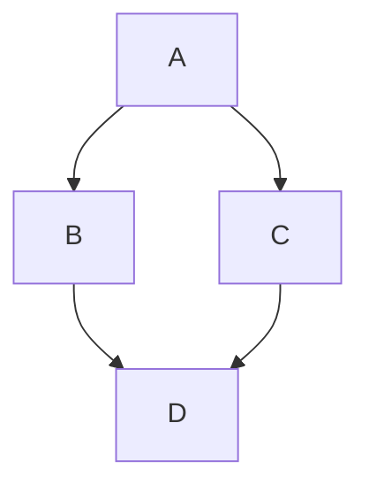

# Marketplace Alert Bot

<!--  <!-- Optional: add a logo if you have one -->

A self-hosted system to monitor online marketplaces and notify users of new listings via Discord.  
The project consists of:

1. **Backend API** – Manages alerts, listings, and scrapers.
2. **Scrapers** – Modules that fetch listings from marketplaces (Craigslist, Facebook Marketplace, etc.).
3. **Discord Bot** – User interface for creating alerts and receiving notifications.

> Future plans: Add a web frontend for dashboard-style alert management.

---

## Table of Contents

- [Features](#features)
- [Architecture](#architecture)
- [Getting Started](#getting-started)
- [Development Workflow](#development-workflow)
- [Environment Variables](#environment-variables)
- [Docker Setup](#docker-setup)
- [Testing](#testing)

---

## Features

- Create custom listing alerts via Discord.
- Receive alerts in a dedicated channel or via direct message.
- Easily extendable with new scrapers for additional marketplaces.
- Scalable architecture: backend API can support multiple frontends.
- Fully self-hosted.

---

## Architecture

### Diagram



- **Discord Bot** communicates with the backend via REST API.
- **Backend** handles business logic, scrapers, and database operations.
- **Scrapers** are modular and can be added without changing the API.
- **Database** stores alerts, listings, and user info.

---

## Getting Started

### Prerequisites

- Python 3.11+
- Docker & Docker Compose (for full-stack setup)
- Git

### Clone Repository

```bash
git clone https://github.com/dhruvdingari8/marketscraper-backend.git
cd marketplace-backend
```

### Environment Setup
```bash
cp .env.example .env
# Fill in your Discord token, database credentials, etc.
```

---

## Development Workflow

### Local Development (Fast Iteration)
1. Create a Python virtual environment:
```bash
python -m venv .venv
source .venv/bin/activate
pip install -r requirements.txt
```
3. Run the backend API locally:
```bash
uvicorn app.main:app --reload
```
5. Run the Discord bot (in a separate terminal):
```bash
cd ../discord-bot
source .venv/bin/activate
python bot.py
```

### Docker Development (Full-Stack)
```bash
docker compose up --build
```
* Backend API: http://localhost:8000
* Discord Bot connects automatically to backend via environment variable.
* PostgreSQL runs in a container.

---

## Environment Variables

| Variable  | Description |
| --------- | ----------- |
| `DISCORD_TOKEN` | Discord bot token  |
| `DATABASE_URL`  | PostgreSQL connection string  |
| `API_PREFIX` | API route prefix (default: `/api/v1`) |
| `SECRET_KEY` | JWT secret key for authentication |
| `SCRAPER_INTERVAL` | Interval (seconds) for scraper jobs |

---

## Docker Setup

You can run the full backend + database stack using Docker Compose. This ensures a consistent environment for all developers and matches production as closely as possible.

### Build and run the containers

```bash
docker compose up --build
```
* Backend API: http://localhost:8000
* PostgreSQL database: runs inside a container and persists data in a Docker volume.

### Stop Containers
```bash
docker compose down
```
This will stop all containers. Add -v if you want to also remove volumes:
```bash
docker compose down -v
```

### Environment Variables
Docker will automatically load environment variables from your .env file (copied from .env.example):
```bash
cp .env.example .env
# Fill in your actual credentials and secrets
```

---

## Testing
* Run unit tests locally
```bash
pytest -v tests/
```
* Run tests inside Docker
```bash
docker compose exec backend pytest -v tests/
```
